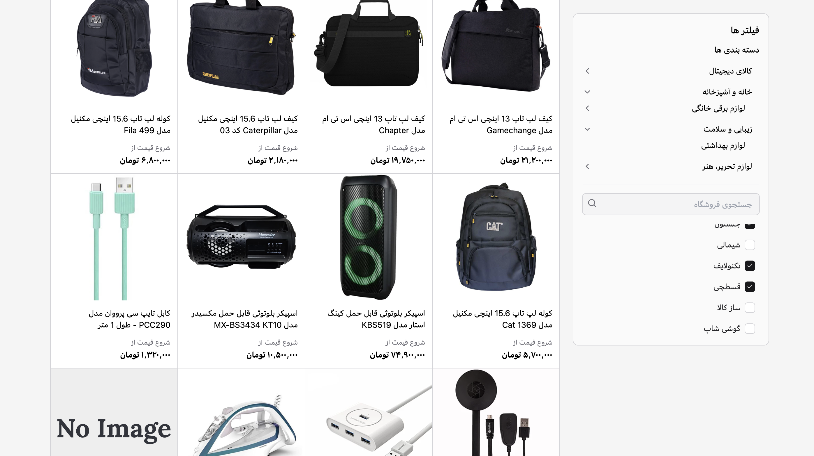

# Azkivam Coding Challenge

## Demo

- Live: [azkivam-coding-challenge.netlify.app](https://azkivam-coding-challenge.netlify.app/)

## Features

- Product listing with infinite scroll
- Category and merchant filters
  - Filter state synced to the URL (`merchantIds=1,2`)
  - Filters preserved when navigating between products pages
- Category-scoped product listing (`/products/:id/[[slug]]`) using an optional slug to reduce route duplication
- Skeleton loaders for better perceived performance (`ProductCardSkeleton`, `CategoryListSkeleton`, `MerchantListSkeleton`)
- Custom styled scrollbar via Tailwind utility (`.scrollbar-custom`)
- Robust image handling with `NuxtImg` and a local fallback for broken images

## Tech Stack

- Nuxt 4 (Vue 3 + Vite)
- TypeScript
- Tailwind CSS
- @vueuse/core (infinite scroll, utilities)
- @nuxt/image (optimized images)
- ESLint + Prettier

## Getting Started

1. Install dependencies
   - `pnpm install`
2. Run the dev server
   - `pnpm dev`
3. Build for production
   - `pnpm build`
4. Preview production build
   - `pnpm preview`

## Project Structure (high-level)

- `app/components/` UI components
  - `products/` product list, cards, skeletons, filters UI
  - `categories/` category list and skeleton
  - `merchants/` merchant list and skeleton
- `app/pages/`
  - `products/index.vue` product listing
  - `products/[id]/[[slug]].vue` category-scoped listing with optional slug
- `app/composables/` data fetching and state
  - `products/` (`useProduct`, `useProductByCategory`, services, transforms, types)
  - `categories/` (`useCategory`)
  - `merchants/` (`useMerchant`)
- `public/` static assets (e.g., `public/demo.png`)

## Configuration

- Runtime config (public)
  - `apiBaseUrl`: base URL for API
  - `apiTimeout`: request timeout
- Images
  - Uses `@nuxt/image`. For remote images/CDN, configure providers as needed.
  - Netlify deployments can use `netlify.toml` with `[images]` `remote_images` to allowlist remote sources.

## Notable Implementation Details

- Infinite scroll is implemented with `useInfiniteScroll(window, loadMore)` from `@vueuse/core`.
- Filter state is read from and written to the URL query (e.g., `merchantIds`), and product queries watch these values to refetch/reset pagination.
- Category pages are consolidated with an optional slug route to avoid duplication.
- `ProductCard.vue` swaps to a placeholder image on actual load errors (404/broken URLs).

## Scripts

- `pnpm dev` start dev server
- `pnpm build` production build
- `pnpm preview` preview built app
- `pnpm lint` run ESLint
- `pnpm lint:fix` fix lint issues
- `pnpm format` format with Prettier
